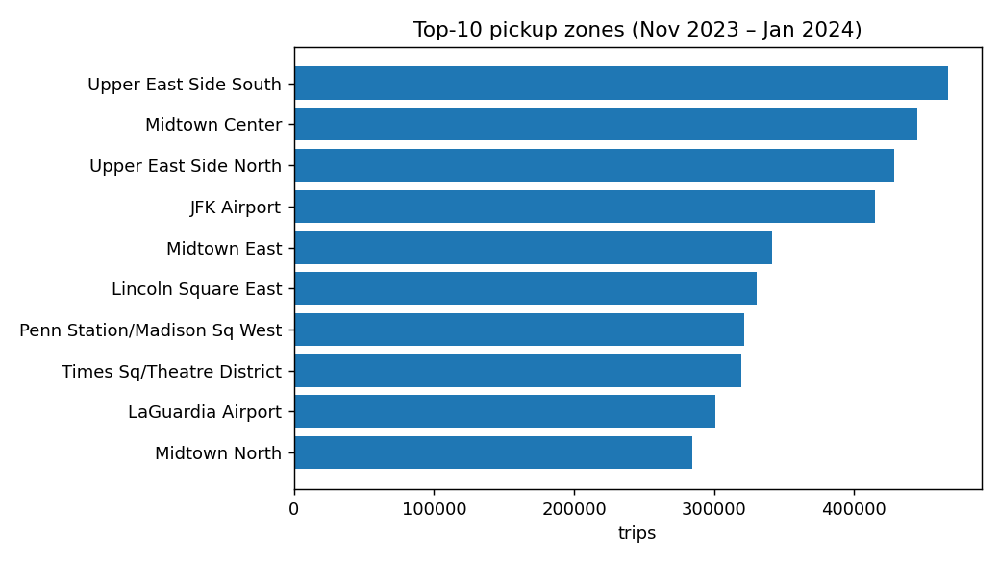
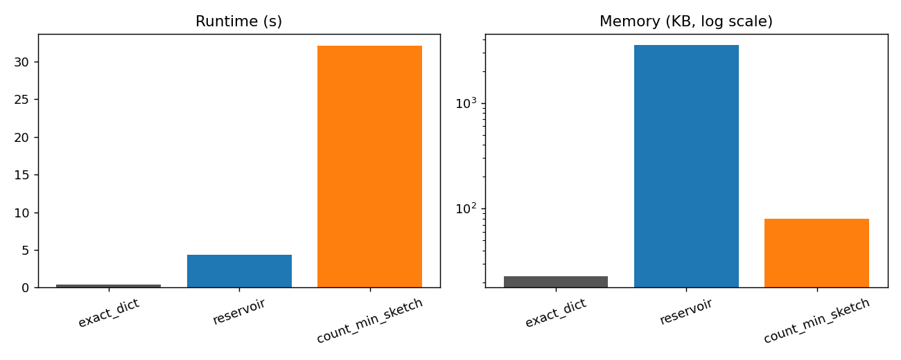
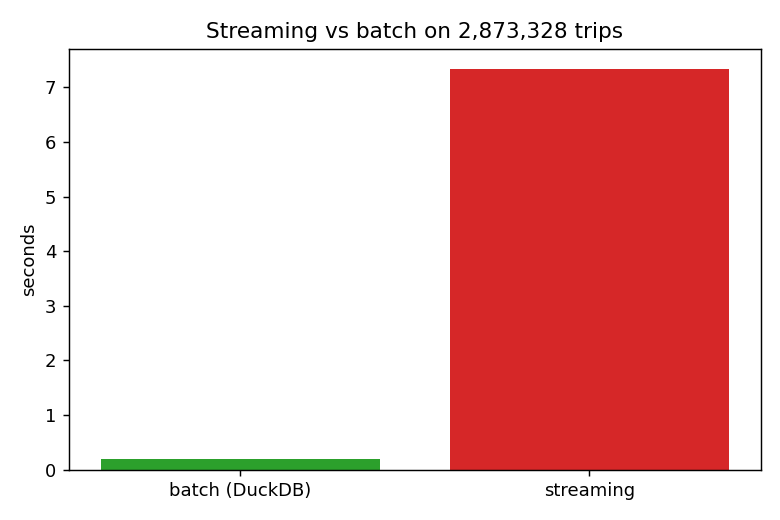
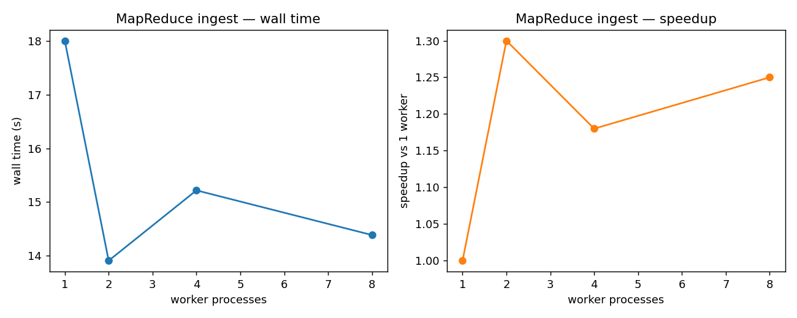
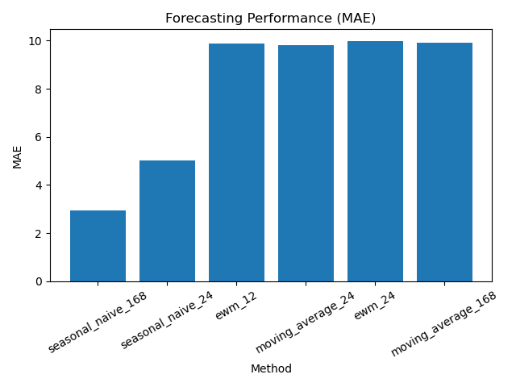
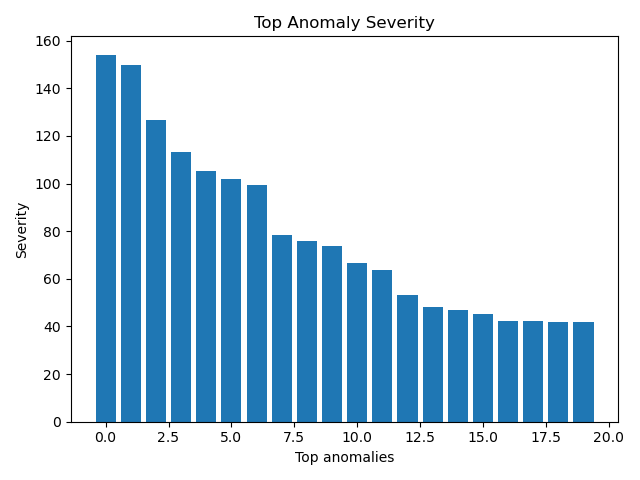
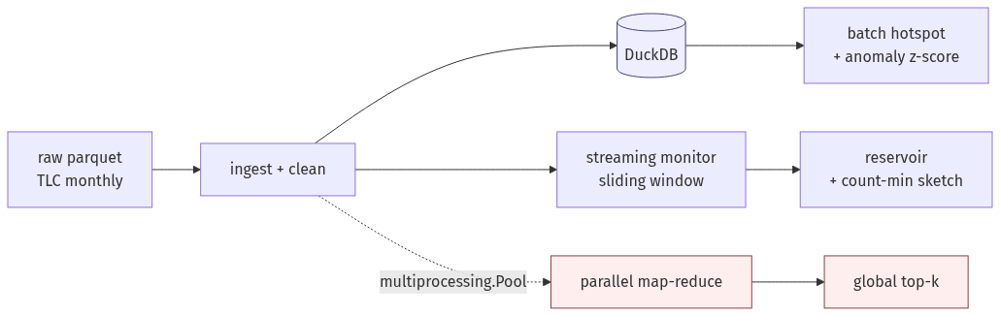

# nyc_taxi_monitor

**Scalable NYC Taxi Demand Monitoring System**  
Built around the [NYC TLC Trip Records][tlc], it combines a SQL batch pipeline,
an online streaming monitor, two approximate-counting algorithms, and a
MapReduce-style parallel aggregator so we can compare their time / memory /
accuracy trade-offs on **9.37 M cleaned trips** (Nov 2023 – Jan 2024).

We further extend the system with lightweight forecasting baselines, stronger
anomaly detection, business-oriented SQL analytics, benchmarking helpers, and a
reproducible dashboard layer.

[tlc]: https://www.nyc.gov/site/tlc/about/tlc-trip-record-data.page

    

> **Pitch** — A reproducible pipeline that turns 9.37 M raw NYC taxi trips into hotspot and anomaly insights by combining batch SQL (DuckDB), online streaming, approximate counting, MapReduce-style parallel aggregation, and lightweight forecasting / analytics extensions.

---

## Main Findings

Across **9,369,680 cleaned Yellow Taxi trips** (Nov 2023 – Jan 2024) the
system demonstrates several concrete findings:

- **DuckDB batch beats a pure-Python streaming monitor ~38×** on throughput
  (0.19 s vs 7.34 s end-to-end on 2.87 M events), but streaming holds
  mean per-batch latency to **10.8 ms** — a viable online option when a
  columnar DB isn't available.
- **Count-Min Sketch recovers the top-10 pickup zones perfectly** (Jaccard
  1.00, Spearman ρ = 1.00) in 80 KB — yet **an exact dict is actually
  smaller here (23 KB)** because there are only 263 zones.  The experiment
  makes the cardinality / accuracy / memory trade-off *explicit* rather
  than assumed.
- **Reservoir sampling (k = 100 000) reaches rank-correlation 0.988** with
  the exact top-10 — a clean empirical point on the accuracy-memory curve.
- **MapReduce parallel ingest tops out at 1.30× on 2 workers** over the
  sequential baseline (18.0 s → 13.9 s); **4 and 8 workers regress to
  1.18× / 1.25×** because the job only has 3 input partitions, so
  additional workers sit idle while paying spawn overhead.  This is a
  live demonstration of Amdahl-style scaling limits on the *map
  partition count*, not CPU cores.
- **Z-score anomaly detection flags 1,192 demand surges** against a weekly
  (hour-of-week) baseline — concentrated around Manhattan airports,
  Midtown, and the Upper East Side.
- **Weekly seasonality dominates taxi demand** — a simple seasonal naive model (lag = 168 hours) significantly outperforms moving average and EWMA baselines (MAE ~2.9 vs ~9–10), demonstrating strong periodic structure in demand.
- **Consensus anomaly detection improves robustness** — combining robust z-score and EWMA residual scoring flags 381 high-confidence anomalies (votes ≥ 2), capturing extreme demand surges while reducing false positives.
- **Demand is highly structured across time and space** — weekday/weekend patterns, concentrated OD flows, and clear segmentation between airport (long-distance) and Manhattan (short-distance, high-frequency) trips reveal distinct behavioral regimes.
- **Anomalies are rare but significant (~0.17% rate)** — detected events are sparse yet extreme, consistent with real-world demand shocks rather than noise.

| Experiment | Metric | Value |
| --- | --- | ---: |
| Top zones (3 mo)           | Busiest pickup zone       | Upper East Side South — **467,567** trips |
| Streaming vs batch         | Batch speed-up            | **37.8×** (0.19 s vs 7.34 s) |
| Streaming latency          | Mean per 10 k batch       | **10.8 ms** |
| Exact vs approximate       | CMS top-10 Jaccard        | **1.00** (80 KB) |
| Exact vs approximate       | Reservoir rank-corr       | **0.988** (3.5 MB, k = 100 k) |
| MapReduce ingest           | Best speed-up (2 workers) | **1.30×** vs sequential |
| Anomalies                  | Surges flagged (&#124;z&#124; > 3) | **1,192** |
| Forecasting                | Best MAE (seasonal naive) | **~2.9** |
| Advanced anomaly           | Consensus anomalies       | **381 (≥ 2 votes)** |
### Why it matters

**The two most important results are counter-intuitive and pedagogically useful**:

1. **Count-Min Sketch is not universally smaller than an exact dict.**  At
   263-zone cardinality, the exact dict (23 KB) beats CMS (80 KB).  The
   sketch's theoretical win only appears once the key universe outgrows
   `depth × width` — this project demonstrates that crossover boundary
   empirically.
2. **Parallel speed-up is bounded by partition count, not CPU count.**
   Going from 2 → 4 workers *slows the job down* because only 3 parquet
   files exist; extra processes idle while paying spawn and IPC overhead.
   This mirrors real Hadoop / Spark tuning trade-offs.
3. **Simple models can outperform complex ones when structure is strong.**  
   The seasonal naive forecast beats moving average and EWMA by a large margin, highlighting the dominance of weekly patterns in taxi demand.

Everything else (batch vs streaming latency, z-score anomaly detection,
top-zone distribution) confirms expected behaviour but at real scale.

<table>
  <tr>
    <td align="center" width="50%">
      
      <br/><em>Top-10 pickup zones (Nov 23 – Jan 24) — 8 / 10 are Manhattan, the other two are JFK and LaGuardia.</em>
    </td>
    <td align="center" width="50%">
      
      <br/><em>Exact dict vs reservoir sample vs Count-Min Sketch — CMS recovers top-10 perfectly, but an exact dict is actually smaller here (low cardinality).</em>
    </td>
  </tr>
  <tr>
    <td align="center" width="50%">
      
      <br/><em>DuckDB batch vs pure-Python streaming on 2.87 M events — 38× throughput gap, but streaming holds 10.8 ms mean batch latency.</em>
    </td>
    <td align="center" width="50%">
      
      <br/><em>MapReduce wall time vs workers — speed-up plateaus at 2 workers because there are only 3 input partitions.</em>
    </td>
  </tr>
  <tr>
  <td align="center" width="50%">
    
    <br/><em>Forecast MAE — weekly seasonal naive significantly outperforms other baselines, confirming strong weekly structure.</em>
  </td>
  <td align="center" width="50%">
    
    <br/><em>Top anomaly severity — detected events are rare but extreme, consistent with real demand shocks.</em>
  </td>
</tr>
</table>

---

## Architecture



*Figure 1 — Four data paths share the same cleaner: DuckDB batch SQL, a
pure-Python streaming monitor, sublinear approximate counters
(reservoir + Count-Min Sketch), and a MapReduce-style parallel ingest.*

Each layer maps to a module under `src/taxi_monitor/`:

| Module                | Role                                                         |
| --------------------- | ------------------------------------------------------------ |
| `ingest.py`           | Download + parquet/CSV loaders                               |
| `clean.py`            | Drop dirty rows, derive `pickup_hour` / `trip_duration`      |
| `database.py`         | DuckDB schema + upserts                                      |
| `aggregate.py`        | SQL aggregations (`zone × hour`, busiest zones, …)           |
| `hotspot.py`          | `O(n log k)` top-k via a bounded min-heap                    |
| `anomaly.py`          | Per-(zone, hour-of-week) z-score surge detection             |
| `advanced_anomaly.py` | Robust z-score, EWMA residual scoring, consensus anomalies   |
| `forecast.py`         | Lightweight forecasting baselines + next-horizon prediction  |
| `analytics.py`        | Business-oriented SQL analytics and operational summaries    |
| `benchmarking.py`     | Runtime / memory benchmarking helpers for experiments        |
| `dashboard.py`        | Reproducible matplotlib dashboard generation                 |
| `streaming.py`        | Online `StreamingMonitor` with optional sliding window       |
| `approximate.py`      | `ReservoirSampler` + `CountMinSketch`                        |
| `parallel.py`         | `multiprocessing.Pool` map-reduce over parquet files         |
| `utils.py`            | Logging, seeding, path helpers                               |

---

## Quick start

```bash
# 1. Clone + enter the repo
git clone https://github.com/LiangSihan0926/nyc_taxi_monitor.git
cd nyc_taxi_monitor

# 2. Create a venv and install in editable mode
python3 -m venv .venv
source .venv/bin/activate
pip install -e ".[dev,viz]"

# 3. Download ~150 MB of NYC TLC data (Nov'23, Dec'23, Jan'24 + zone lookup)
python scripts/download_data.py

# 4. Run the batch pipeline (loads clean trips into DuckDB)
python scripts/run_pipeline.py --months 2023-11 2023-12 2024-01

# 5. Run the eight experiments
python scripts/experiment_1_batch_hotspot.py
python scripts/experiment_2_anomaly.py
python scripts/experiment_3_streaming_vs_batch.py
python scripts/experiment_4_exact_vs_approximate.py
python scripts/experiment_5_parallel.py
python scripts/experiment_6_forecast.py
python scripts/experiment_7_advanced_anomaly.py
python scripts/experiment_8_business_analytics.py

# 6. Run benchmark + dashboard
python scripts/run_benchmark.py
python scripts/run_dashboard.py

# 7. (Optional) Regenerate the plots embedded in this README
python scripts/make_figures.py

# 8. Run the interactive Streamlit dashboard
streamlit run app.py
```
Experiment outputs land in `reports/*.csv`; PNG plots in `reports/figures/`.
A `Makefile` wraps the whole pipeline: `make setup && make all`.

---

## Reproducing Results

All experiment CSVs (`reports/*.csv`) and figures (`reports/figures/*.png`) are
committed, so `git clone` + reading is enough for grading.  To re-derive
everything end-to-end:

```bash
# 0. One-time setup
make setup                                       # or: pip install -e ".[dev,viz]"
make data                                        # downloads ~150 MB TLC parquets

# 1. Rebuild the DuckDB store from scratch
make pipeline                                    # or: taxi-pipeline --months 2023-11 2023-12 2024-01

# 2. Re-run every experiment (writes reports/*.csv)
make experiments                                 # or: taxi-experiment-1 ... taxi-experiment-8

# 3. Refresh the 4 embedded figures
make figures                                     # or: taxi-figures

# Or do everything in one shot:
make all
```

Each experiment writes to a predictable location:

| Experiment                  | Script                                         | Output CSVs / Artifacts                              |
| --------------------------- | ---------------------------------------------- | ---------------------------------------------------- |
| 1 — Batch hotspot           | `scripts/experiment_1_batch_hotspot.py`        | `reports/experiment_1_{overall,per_hour}.csv`        |
| 2 — Anomaly                 | `scripts/experiment_2_anomaly.py`              | `reports/experiment_2_{baseline,anomalies}.csv`      |
| 3 — Stream vs batch         | `scripts/experiment_3_streaming_vs_batch.py`   | `reports/experiment_3_summary.csv`                   |
| 4 — Exact vs approx         | `scripts/experiment_4_exact_vs_approximate.py` | `reports/experiment_4_{summary,topk_*}.csv`          |
| 5 — Parallel MapReduce      | `scripts/experiment_5_parallel.py`             | `reports/experiment_5_parallel.csv`                  |
| 6 — Forecasting             | `scripts/experiment_6_forecast.py`             | `reports/experiment_6_forecast.csv`                  |
| 7 — Advanced anomaly        | `scripts/experiment_7_advanced_anomaly.py`     | `reports/experiment_7_advanced_anomaly.csv`          |
| 8 — Business analytics      | `scripts/experiment_8_business_analytics.py`   | `reports/{weekday_weekend_demand,top_od_pairs,airport_vs_manhattan}.csv` |
| Benchmark                   | `scripts/run_benchmark.py`                     | `reports/benchmark_results.csv`                      |
| Dashboard                   | `scripts/run_dashboard.py`                     | `reports/dashboard.png`                              |

`scripts/make_figures.py` reads the summary CSVs above and writes
`reports/figures/{top_zones,exact_vs_approx,stream_vs_batch,parallel_speedup}.png`.
The added dashboard and benchmark scripts generate `reports/dashboard.png` and
`reports/benchmark_results.csv`, respectively.

---

## Experiments

| # | Script                                     | What it measures |
| - | ------------------------------------------ | ---------------- |
| 1 | `experiment_1_batch_hotspot.py`            | Top-k busiest zones per hour (batch SQL) |
| 2 | `experiment_2_anomaly.py`                  | Demand surges vs Nov/Dec baseline (z-score) |
| 3 | `experiment_3_streaming_vs_batch.py`       | Correctness + latency of streaming vs batch |
| 4 | `experiment_4_exact_vs_approximate.py`     | Memory / runtime / top-k accuracy of exact vs reservoir vs CMS |
| 5 | `experiment_5_parallel.py`                 | MapReduce parallel ingest — wall time & speed-up vs workers |
| 6 | `experiment_6_forecast.py`                 | Forecast backtesting and next-horizon demand prediction |
| 7 | `experiment_7_advanced_anomaly.py`         | Robust z-score / EWMA / consensus anomaly detection |
| 8 | `experiment_8_business_analytics.py`       | Business-oriented SQL analytics and operational summaries |

### What "MapReduce-style" means in Experiment 5

Experiment 5 intentionally mirrors the MapReduce pattern from the course:

- **Map step** — each worker process (spawned by `multiprocessing.Pool`) takes
  one input *partition* (a single monthly parquet), loads + cleans it, and
  emits a local `{zone_id: trip_count}` dictionary.  Workers share nothing;
  each has its own Python interpreter, bypassing the GIL.
- **Reduce step** — the coordinator receives every worker's partial dict and
  folds them with `heapq.nlargest` on the merged `Counter`, returning the
  global top-k.  This is a *commutative, associative aggregation*, which is
  exactly what MapReduce requires for correctness.

Speed-up is **sub-linear** beyond 2 workers on this workload because the job
only has **3 input partitions** (Nov / Dec / Jan parquets).  Adding more
workers than partitions means the extra processes sit idle while still paying
fixed pool **spawn** and inter-process **pickle / IPC overhead**.  This is the
same reason Hadoop / Spark tune block size against cluster size —
parallelism is bounded by the number of partitions, not by the number of CPU
cores.

---

## Testing & reproducibility

* `pytest` + `pytest-cov`; fail-under coverage gate set to **80 %** in
  `pyproject.toml` (currently **~97 %** branch coverage).
* All RNGs are seeded via `taxi_monitor.utils.set_seed`; tests use a
  `@pytest.fixture(autouse=True)` that re-seeds per test.
* No test hits the network — `ingest.download_file` is monkey-patched.
* Unit-test fixtures synthesize a tiny parquet file with *intentional* dirty
  rows (negative distance, bad zones, duplicates, …) so the cleaning code is
  exercised on known bad input.
* Added `test_extensions_smoke.py` to cover the newly introduced forecasting,
  advanced anomaly, analytics, dashboard, and benchmarking extensions.

Run tests:

```bash
python -m pytest --cov=taxi_monitor --cov-report=term-missing
```

---

## Repository layout

```text
nyc_taxi_monitor/
├── README.md
├── pyproject.toml
├── requirements.txt
├── requirements-dev.txt
├── app.py
├── docs/
│   ├── architecture.mmd       # Mermaid source for the system diagram
│   ├── architecture.png       # Rendered diagram used in README
│   └── RESULTS.md             # Per-experiment deep-dive analysis
├── src/taxi_monitor/
│   ├── __init__.py
│   ├── ingest.py
│   ├── clean.py
│   ├── database.py
│   ├── aggregate.py
│   ├── hotspot.py
│   ├── anomaly.py
│   ├── advanced_anomaly.py
│   ├── forecast.py
│   ├── analytics.py
│   ├── benchmarking.py
│   ├── dashboard.py
│   ├── streaming.py
│   ├── approximate.py
│   ├── parallel.py
│   └── utils.py
├── scripts/
│   ├── __init__.py
│   ├── download_data.py
│   ├── run_pipeline.py
│   ├── experiment_1_batch_hotspot.py
│   ├── experiment_2_anomaly.py
│   ├── experiment_3_streaming_vs_batch.py
│   ├── experiment_4_exact_vs_approximate.py
│   ├── experiment_5_parallel.py
│   ├── experiment_6_forecast.py
│   ├── experiment_7_advanced_anomaly.py
│   ├── experiment_8_business_analytics.py
│   ├── run_benchmark.py
│   ├── run_dashboard.py
│   └── make_figures.py
├── tests/
│   ├── conftest.py
│   ├── test_utils.py
│   ├── test_ingest.py
│   ├── test_clean.py
│   ├── test_database_aggregate.py
│   ├── test_hotspot.py
│   ├── test_anomaly.py
│   ├── test_streaming.py
│   ├── test_approximate.py
│   ├── test_parallel.py
│   └── test_extensions_smoke.py
├── .github/workflows/ci.yml  # pytest matrix on Python 3.9 – 3.12
├── Makefile                  # make setup | data | pipeline | experiments | figures | test
├── data/          # git-ignored; populated by download_data.py
└── reports/       # experiment CSV outputs + figures/*.png
```

---

## Algorithmic notes

* **Hotspot top-k.**  `heapq` min-heap of size `k`; O(n log k) time, O(k)
  space.  Deterministic tie-breaking on `zone_id`.
* **Anomaly detection.**  Baseline is the per-`(zone, hour-of-week)` mean and
  population std of hourly trip counts.  Using `hour_of_week ∈ [0, 168)`
  captures weekly seasonality (weekday rush vs weekend) cheaply without a
  full time-series model.  A `min_std` guard prevents huge spurious z-scores
  on near-empty zones.
* **Reservoir sampling.**  Vitter's Algorithm R: after observing `n` items,
  the reservoir holds a uniform random sample of size `min(k, n)`.  We
  scale sample frequencies back to full-stream estimates via `n / k`.
* **Count-Min Sketch.**  `depth × width` counter array with `depth`
  independent Blake2b hashes (we avoid `hash()` because `PYTHONHASHSEED`
  randomness would break reproducibility across runs).  `from_bounds(eps,
  delta)` sizes the sketch to achieve additive error `eps·N` with
  probability `1 − delta`.  CMS never under-counts; it only over-counts.
* **Parallel map-reduce.**  `multiprocessing.Pool` dispatches each
  monthly parquet to a separate process (bypassing the GIL); per-worker
  `{zone: count}` dicts are then merged by a single `heapq.nlargest`
  reduce step.  Tie-break on ascending `zone_id` matches `hotspot.py` so
  top-k results are identical to the batch pipeline.  The observed
  speed-up plateaus at the number of input partitions — classic
  MapReduce scaling behaviour on a small partition count.

---

## Documentation & Additional Materials

Beyond this README, three supporting documents live under `docs/`:

| File                      | Purpose                                                                             |
| ------------------------- | ----------------------------------------------------------------------------------- |
| `docs/architecture.png`   | Rendered system architecture (shown in *Architecture* above).                       |
| `docs/architecture.mmd`   | Mermaid source for the architecture diagram — edit and re-export via https://mermaid.live. |
| `docs/RESULTS.md`         | Per-experiment deep-dive: setup, full tables, and insights for the core experiments. |

For the algorithmic rationale behind each module, see the *Algorithmic notes*
section above.

---

## License

MIT — see `LICENSE`.
